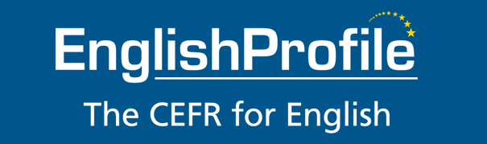
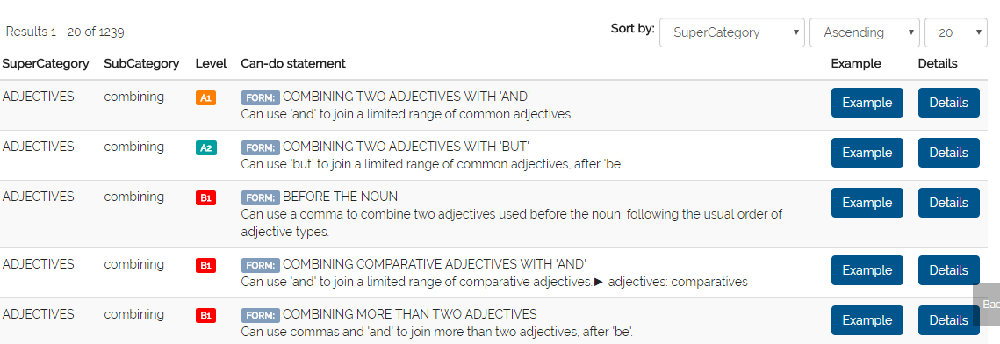
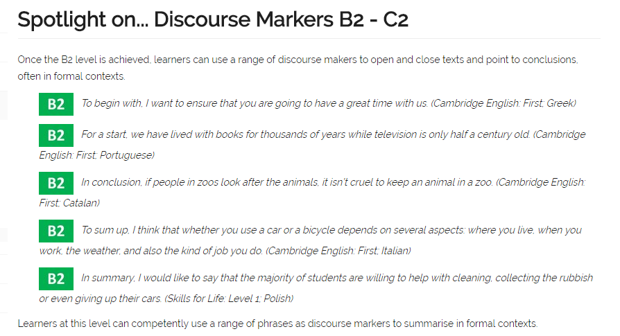

# English Grammar Profile
The English Grammar Profile allows us to see how learners develop competence in grammatical form and meaning, as well as pragmatic appropriateness, as they move up the CEFR levels. This provides us with typical, world-wide grammar profiles for each level.

for more detail: [www.englishprofile.org](http://www.englishprofile.org/english-grammar-profile)

# Grammar Spotlight
The English Grammar Profile (EGP) is a sister resource to the English Vocabulary Profile, and has been put together by Anne O'Keeffe (Limerick University) and Geraldine Mark, the co-authors, along with Ron Carter and Mike McCarthy, [of English Grammar Today](http://www.cambridge.org/gb/cambridgeenglish/catalog/grammar-vocabulary-and-pronunciation/english-grammar-today) (Cambridge University Press). Mark and O'Keeffe investigated the extensive data in the Cambridge Learner Corpus to establish when learners begin to get to grips with different linguistic structures. 

A series of insights from their research will be posted on this page, each one putting the spotlight on an interesting aspect of learner grammar development. Please note that all of the learner examples come from the Cambridge Learner Corpus, a 55-million word electronic collection of written learner data. The examination and the candidate’s first language are given in brackets after each learner example.

# EPUB format copy
This reporsitory is used to keep a copy of below 2 files:

1. Grammar Spotlight (1-60), EPUB format [download](asset/egpo.xlsx)
2. English Grammar Profile (1239 items), MS Excel format [download](asset/egpo-gs.epub)

